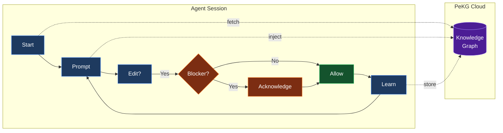

#  PeKG Plugins

[](LICENSE) [](VERSION)

Cross-project knowledge graph for AI coding agents.

- **Solo:** fix a bug once, never hit it again.
- **Team:** the whole engineering org learns from every fix.

[Quick Start](#quick-start) | [Why PeKG](#why-pekg) | [For Teams](#for-teams--enterprises) | [How It Works](#how-it-works) | [Supported Agents](#supported-agents) | [Features](#features)

---

## Quick Start

### Solo

Ask your agent:

```
Read https://pekg.ai/llms.txt and set up PeKG
```

That's it. The agent reads the instructions, installs the plugin, and walks you through connecting.

### Team

1. Admin: sign up at [app.pekg.ai](https://app.pekg.ai) — your org is created automatically
2. Invite teammates from [Settings → Organization](https://app.pekg.ai/settings/org) (SSO config in [Settings → SSO](https://app.pekg.ai/settings/sso))
3. Each engineer runs the agent install above and signs in
4. Done. Knowledge promoted to the team pool surfaces in every teammate's session — including new hires from day one

---

## Why PeKG

**The problem:** Your AI agent is smart, but it forgets everything between sessions. You fix the same bugs, rediscover the same patterns, hit the same gotchas — over and over.

**The solution:** PeKG builds a personal knowledge graph from your work. When you encounter something worth remembering, it gets captured. When you're about to hit a known issue, you get warned before wasting time.

---

## For Teams & Enterprises

When one engineer learns something the hard way, the whole team gets it for free.

### Shared Knowledge, Three Tiers

<table width="100%">
<thead>
<tr><th width="22%">Tier</th><th width="28%">Visibility</th><th width="50%">Use case</th></tr>
</thead>
<tbody>
<tr><td><strong>Private</strong></td><td>You only</td><td>Personal patterns, work-in-progress</td></tr>
<tr><td><strong>Team Pool</strong></td><td>Your org</td><td>Deploy gotchas, internal conventions, post-mortems</td></tr>
<tr><td><strong>Hive</strong> (opt-in)</td><td>Public community</td><td>Generic patterns worth sharing back</td></tr>
</tbody>
</table>

You choose what gets promoted. Selective sharing means a `prod deploy` blocker goes to the team; a generic `JWT clock skew` pattern can go to Hive. Nothing leaves your org without an explicit promote.

### Newcomer Onboarding in Minutes

A new hire connects their agent to your org's PeKG. From the first prompt:

- Your team's blockers fire on their machine
- "How does X service work?" surfaces decisions your seniors made 6 months ago
- They stop pinging Slack for context that already lives in the graph

No tribal knowledge silos. The graph is the onboarding doc.

### Enterprise

- **SSO** — OIDC / SAML
- **Audit log export**
- **Federated search** across team pools
- **Unlimited** sources, articles, entities, users, projects
- **Dedicated support**

---

## How It Works



### The Loop

1. **Session Start** — Plugin checks your KB health, fetches recent context
2. **Prompt Submit** — Relevant knowledge injected based on current task + file
3. **Pre-Tool Gate** — If blockers exist for this context, file edits are blocked
4. **Acknowledge** — You describe your mitigation, agent verifies, tools unblock
5. **Post-Tool** — Patterns and learnings extracted, queued for compilation
6. **Compile** — PeKG's lightweight classifier clusters and tags; your agent does heavy lifting

### Blockers

When you're about to repeat a known mistake, PeKG injects a blocker:

```xml
<pekg-active-blockers>
- Deploy Gotcha: SCP files get wiped by git pull + pnpm build
</pekg-active-blockers>
```

File-editing tools (`edit`, `write`, `apply_patch`, etc.) are gated until you acknowledge with a **concrete mitigation** — not just "noted" or "I understand."

---

## Supported Agents & Extensions

### AI Coding Agents

<table width="100%">
<thead>
<tr><th width="22%">Agent</th><th width="23%">Type</th><th width="55%">Install</th></tr>
</thead>
<tbody>
<tr><td><strong>OpenCode</strong></td><td>TypeScript plugin</td><td><code>curl -o ~/.config/opencode/plugins/pekg.ts https://api.pekg.ai/plugins/opencode.ts</code></td></tr>
<tr><td><strong>Claude Code</strong></td><td>Bash hooks</td><td><code>curl -fsSL https://api.pekg.ai/plugins/claude-code/install.sh | bash</code></td></tr>
<tr><td><strong>Codex</strong></td><td>Bash hooks</td><td><code>curl -fsSL https://api.pekg.ai/plugins/codex/install.sh | bash</code></td></tr>
<tr><td><strong>Cursor / Windsurf</strong></td><td>MCP server</td><td>Via <code>llms.txt</code></td></tr>
</tbody>
</table>

### IDE Plugins

<table width="100%">
<thead>
<tr><th width="22%">Plugin</th><th width="78%">Description</th></tr>
</thead>
<tbody>
<tr><td><strong>VS Code</strong></td><td>Context panel, search, inline hints</td></tr>
<tr><td><strong>JetBrains</strong></td><td>IntelliJ, WebStorm, PyCharm, all JetBrains IDEs</td></tr>
<tr><td><strong>Obsidian</strong></td><td>Search and ingest from your vault</td></tr>
<tr><td><strong>Raycast</strong></td><td>Quick search and ingest from macOS</td></tr>
</tbody>
</table>

### Webhook Integrations

<table width="100%">
<thead>
<tr><th width="22%">Integration</th><th width="18%">Type</th><th width="60%">Description</th></tr>
</thead>
<tbody>
<tr><td><strong>Slack</strong></td><td>OAuth</td><td>Post to channels, receive commands</td></tr>
<tr><td><strong>Discord</strong></td><td>OAuth</td><td>Notifications and commands</td></tr>
<tr><td><strong>Microsoft Teams</strong></td><td>Webhook</td><td>Adaptive Cards via Workflows</td></tr>
<tr><td><strong>Linear</strong></td><td>Webhook</td><td>/pekg commands in issues</td></tr>
<tr><td><strong>Jira</strong></td><td>OAuth</td><td>Sync with Jira projects</td></tr>
<tr><td><strong>GitHub</strong></td><td>OAuth</td><td>PR ingestion, drift checks</td></tr>
<tr><td><strong>Notion</strong></td><td>OAuth</td><td>Sync pages bidirectionally</td></tr>
<tr><td><strong>Google Docs</strong></td><td>Inbound</td><td>Sync docs into knowledge graph</td></tr>
<tr><td><strong>Confluence</strong></td><td>Inbound</td><td>Sync Confluence pages</td></tr>
</tbody>
</table>

### Observability

<table width="100%">
<thead>
<tr><th width="22%">Integration</th><th width="18%">Type</th><th width="60%">Description</th></tr>
</thead>
<tbody>
<tr><td><strong>Datadog</strong></td><td>Webhook</td><td>Metrics and events</td></tr>
<tr><td><strong>Splunk</strong></td><td>Webhook</td><td>HEC integration</td></tr>
<tr><td><strong>PagerDuty</strong></td><td>Webhook</td><td>Drift alert incidents</td></tr>
<tr><td><strong>Opsgenie</strong></td><td>Webhook</td><td>Drift detection alerts</td></tr>
</tbody>
</table>

### Automation

<table width="100%">
<thead>
<tr><th width="22%">Platform</th><th width="78%">Description</th></tr>
</thead>
<tbody>
<tr><td><strong>GitHub Actions</strong></td><td><code>check-drift</code>, <code>context</code>, <code>ingest-pr</code></td></tr>
<tr><td><strong>Zapier</strong></td><td>Connect to 5,000+ apps</td></tr>
<tr><td><strong>n8n</strong></td><td>Workflow automation node</td></tr>
<tr><td><strong>Email Digest</strong></td><td>Weekly knowledge summaries</td></tr>
</tbody>
</table>

All extensions configurable at [app.pekg.ai/settings/extensions](https://app.pekg.ai/settings/extensions)

Or just ask any agent to read `https://pekg.ai/llms.txt`.

---

## Features

### Session Persistence

Context survives between sessions. When you resume with `--continue` or reconnect:

- **Task state** — Current task, completed steps, failed approaches
- **File tracking** — Files read, modified, discovered
- **Blockers** — Active blockers persist until acknowledged
- **Automatic cleanup** — Stale sessions expire after 24h

Stored locally at `~/.pekg/sessions/` and rehydrated on session start.

### Flash Compaction

Zero-cost context compaction that eliminates LLM summarization overhead:

- **No LLM call** — Replaces 15K token summarization with pre-computed structured state
- **Instant** — Saves 30-120s per compaction vs default LLM summary
- **Smart state** — Preserves current task, active files, failed approaches, blockers
- **Always-on** — No fallback to slow summarization, even on empty sessions

When context window fills, the plugin injects a structured prompt instead of asking the LLM to summarize:

```
## Current Task
Fix authentication bug in login flow

## Files
- src/auth/login.ts (modified)
- src/utils/token.ts (read)

## Approaches Already Tried (avoid repeating)
- Tried increasing token expiry - didn't help
- Checked Redis connection - was fine

## ACTIVE BLOCKERS
- [a1b2c3d4] JWT Gotcha: Clock skew causes validation failures

## Instructions
Continue the task. Address blockers first. Avoid failed approaches.
```

### Knowledge Capture

- **Automatic extraction** — Patterns, gotchas, decisions captured from your work
- **Tech detection** — Recognizes 100+ frameworks and tools from file content
- **Entity resolution** — Links mentions of the same concept across projects
- **Deduplication** — Same knowledge isn't stored twice

### Knowledge Retrieval

- **Semantic search** — Vector similarity finds relevant context
- **Tiered injection** — Blockers > Warnings > Info, based on relevance
- **Cross-project** — Knowledge from any project surfaces where needed
- **File-aware** — Context adapts to what you're editing

### Blocker System

- **Pre-tool gate** — Blocks `edit`, `write`, `patch` until acknowledged
- **BYOLLM verification** — Your agent verifies your acknowledgment is concrete
- **Markdown bypass** — Docs aren't gated by code-domain blockers
- **Security carve-outs** — Auth/secrets blockers always gate

### Community Hive

- **Public patterns** — Browse gotchas discovered by other developers
- **Contribute back** — Share your learnings (opt-in)
- **Quality voting** — Community rates pattern usefulness

---

## Repository Structure

```
opencode/           # TypeScript plugin (3.5K lines)
claude-code/        # Bash hooks for Claude Code
  hooks/            # 7 lifecycle hooks
  skills/           # /pekg-connect skill
codex/              # Bash hooks for Codex CLI
  hooks/            # Lifecycle hooks
  prompts/          # Custom prompts
shared/             # Common bash libraries
tests/              # Smoke tests (14 passing)
build.sh            # Builds self-contained dist/
```

---

## Links

<p align="center">
  <a href="https://pekg.ai">Website</a> •
  <a href="https://app.pekg.ai">Dashboard</a>
</p>

---

## License

MIT
