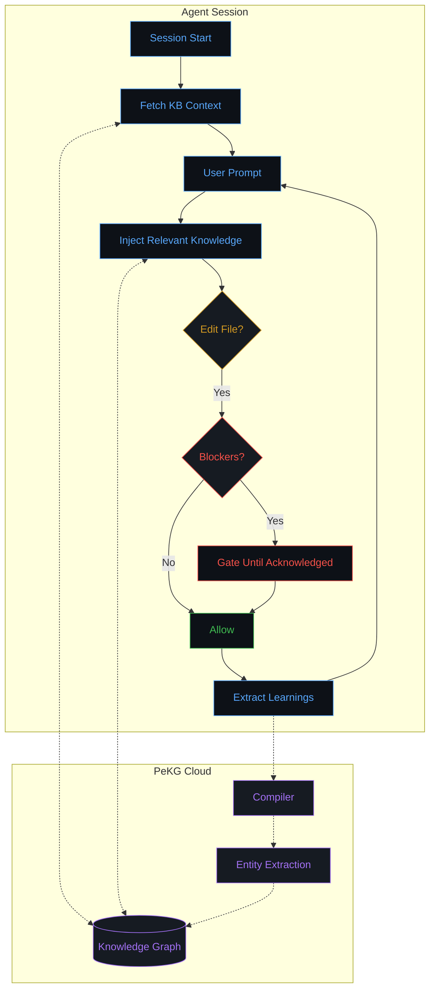

<h1 align="center">
  <br>
  <a href="https://pekg.ai">
    
  </a>
  <br>
  PeKG Plugins
  <br>
</h1>

<h4 align="center">Cross-project knowledge graph plugins for AI coding agents</h4>

<p align="center">
  <a href="https://github.com/PeKG-AI-Inc/plugins/blob/main/LICENSE">
    
  </a>
  <a href="VERSION">
    
  </a>
</p>

<p align="center">
  <a href="#quick-start">Quick Start</a> •
  <a href="#why-pekg">Why PeKG</a> •
  <a href="#how-it-works">How It Works</a> •
  <a href="#supported-agents">Supported Agents</a> •
  <a href="#features">Features</a>
</p>

<p align="center">
  PeKG captures knowledge from your coding sessions and surfaces it when relevant — across all your projects. Fix a bug once, never hit it again. Learn a pattern, have it suggested everywhere.
</p>

---

## Quick Start

Ask your agent:

```
Read https://pekg.ai/llms.txt and set up PeKG
```

That's it. The agent reads the instructions, installs the plugin, and walks you through connecting.

---

## Why PeKG

**The problem:** Your AI agent is smart, but it forgets everything between sessions. You fix the same bugs, rediscover the same patterns, hit the same gotchas — over and over.

**The solution:** PeKG builds a personal knowledge graph from your work. When you encounter something worth remembering, it gets captured. When you're about to hit a known issue, you get warned before wasting time.

| Feature | PeKG | Other tools |
|---------|------|-------------|
| Cross-project learning | Yes | No (per-project only) |
| Blocker enforcement | Yes | No |
| BYOLLM (your tokens) | Yes | Uses their LLM |
| Knowledge graph | Yes | Flat logs |
| Community patterns | Yes (Hive) | No |

---

## How It Works



### The Loop

1. **Session Start** — Plugin checks your KB health, fetches recent context
2. **Prompt Submit** — Relevant knowledge injected based on current task + file
3. **Pre-Tool Gate** — If blockers exist for this context, file edits are blocked
4. **Acknowledge** — You describe your mitigation, agent verifies, tools unblock
5. **Post-Tool** — Patterns and learnings extracted, queued for compilation
6. **Compile** — PeKG's lightweight classifier clusters and tags; your agent does heavy lifting

### Blockers

When you're about to repeat a known mistake, PeKG injects a blocker:

```xml
<pekg-active-blockers>
- Deploy Gotcha: SCP files get wiped by git pull + pnpm build
</pekg-active-blockers>
```

File-editing tools (`edit`, `write`, `apply_patch`, etc.) are gated until you acknowledge with a **concrete mitigation** — not just "noted" or "I understand."

---

## Supported Agents

| Agent | Type | Install |
|-------|------|---------|
| **OpenCode** | TypeScript plugin | `curl -o ~/.config/opencode/plugins/pekg.ts https://api.pekg.ai/plugins/opencode.ts` |
| **Claude Code** | Bash hooks | `curl -fsSL https://api.pekg.ai/plugins/claude-code/install.sh \| bash` |
| **Codex** | Bash hooks | `curl -fsSL https://api.pekg.ai/plugins/codex/install.sh \| bash` |
| **Cursor / Windsurf** | MCP server | Via `llms.txt` |
| **VS Code / JetBrains** | Extensions | Coming soon |

Or just ask any agent to read `https://pekg.ai/llms.txt`.

---

## Features

### Knowledge Capture

- **Automatic extraction** — Patterns, gotchas, decisions captured from your work
- **Tech detection** — Recognizes 100+ frameworks and tools from file content
- **Entity resolution** — Links mentions of the same concept across projects
- **Deduplication** — Same knowledge isn't stored twice

### Knowledge Retrieval

- **Semantic search** — Vector similarity finds relevant context
- **Tiered injection** — Blockers > Warnings > Info, based on relevance
- **Cross-project** — Knowledge from any project surfaces where needed
- **File-aware** — Context adapts to what you're editing

### Blocker System

- **Pre-tool gate** — Blocks `edit`, `write`, `patch` until acknowledged
- **BYOLLM verification** — Your agent verifies your acknowledgment is concrete
- **Markdown bypass** — Docs aren't gated by code-domain blockers
- **Security carve-outs** — Auth/secrets blockers always gate

### Community Hive

- **Public patterns** — Browse gotchas discovered by other developers
- **Contribute back** — Share your learnings (opt-in)
- **Quality voting** — Community rates pattern usefulness

---

## Repository Structure

```
opencode/           # TypeScript plugin (3.5K lines)
claude-code/        # Bash hooks for Claude Code
  hooks/            # 7 lifecycle hooks
  skills/           # /pekg-connect skill
codex/              # Bash hooks for Codex CLI
  hooks/            # Lifecycle hooks
  prompts/          # Custom prompts
shared/             # Common bash libraries
tests/              # Smoke tests (14 passing)
build.sh            # Builds self-contained dist/
```

---

## Links

<p align="center">
  <a href="https://pekg.ai">Website</a> •
  <a href="https://app.pekg.ai">Dashboard</a>
</p>

---

## License

MIT
