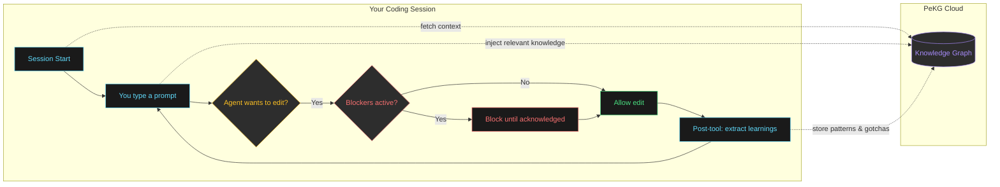

# PeKG Plugins

Official plugins to connect your AI coding agent to [PeKG](https://pekg.ai) - the personal knowledge graph that makes your agent smarter across all your projects.

## What is PeKG?

PeKG builds a cross-project knowledge graph from your coding sessions. When you fix a bug, discover a gotcha, or learn something new, PeKG captures it and surfaces it back when relevant - even in different projects.

- **Cross-project learning** - Knowledge from Project A helps you in Project B
- **Blocker enforcement** - Known gotchas are surfaced before you hit them
- **BYOLLM** - Your agent does all the work, PeKG just stores and retrieves

## Installation

**Easiest way:** Ask your agent to read `https://pekg.ai/llms.txt` - it will set everything up.

**Manual install:**

| Agent | Command |
|-------|---------|
| OpenCode | `curl -o ~/.config/opencode/plugins/pekg.ts https://api.pekg.ai/plugins/opencode.ts` |
| Claude Code | `curl -fsSL https://api.pekg.ai/plugins/claude-code/install.sh \| bash` |
| Codex | `curl -fsSL https://api.pekg.ai/plugins/codex/install.sh \| bash` |

After install, the agent will prompt you to connect via browser (Google sign-in).

## How It Works



**The flow:**
1. **Session Start** - Plugin fetches your KB health stats
2. **Prompt Submit** - Relevant knowledge injected into context
3. **Pre-Tool Gate** - Blockers prevent edits until you acknowledge known gotchas
4. **Post-Tool Learn** - Patterns extracted from your work, stored for future

### Blockers

When you're about to hit a known issue, PeKG blocks file edits until you acknowledge it:

```
<pekg-active-blockers>
- Deploy Gotcha: SCP files get wiped by git pull + pnpm build
</pekg-active-blockers>
```

Describe your mitigation in chat, then tools unblock.

## Links

- https://pekg.ai
- https://app.pekg.ai

## License

MIT
